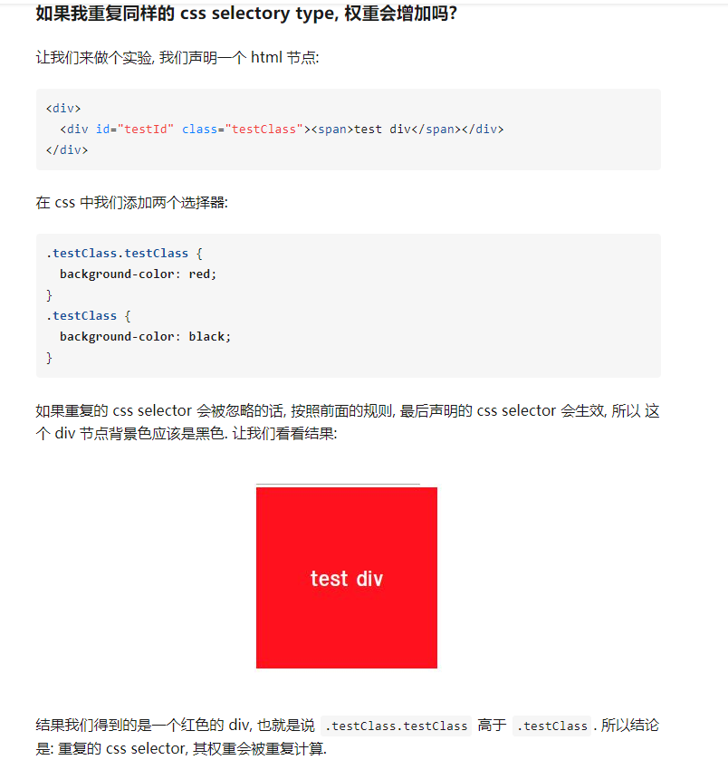

# z-index显示不全问题
<header>
    <div></div>
</header>
<footer>
    <div>
        
    </div>
</footer>
- 如果z-index设置到9999+都没用的话，要考虑的问题是可能外层给挡了。因为浏览器去判断z-index的显示是从外而内，如果footer的z-index=0；img设置再大都没用。
- 因此，要设置外层的z-idnex=XXX，并且不要忘了position，因为z-index起作用是依靠position的。

# position:absolute定位：
- position：absolute绝对定位是相对其父元素的position：relative去定位的。

# box-sizing

作用：用于实现阴影

- 概述属性语法：
    box-shadow：none | &#60;shadow&#62;[,&#60;shadow&#62;]*
  - 默认值为：none
        &#60;shadow&#62;：inset?&&&#60;length&#62;{2,4}&&&#60;color&#62;?
        shadow pattern: 默认outset，即采用outer box-shadow。通过设置为inset时，则采用inner box-shadow.
        horizontal offset: 阴影距离原位置的水平位移，正数表示向右移动，负数表示向左移动。
        vertical offset：阴影距离原位置的垂直位移，正数表示向下移动，负数表示向上移动。
        blur radius:默认值为0，阴影模糊度半径。
        spread distance：默认值为0，扩展或缩小阴影的作用面积。
        color：阴影颜色，默认与color属性一致。
  - outer-box-shadow && inner-box-shadow
      创建一个与元素border-box尺寸一致的阴影盒子
      将阴影盒子定位到元素border-box重合，并位于元素之下
      根据horizontal和vertical来相对原位置做移动
      根据spread distance缩放阴影盒子的尺寸（会影响盒子的位移）
      根据blur radius对阴影盒子做加工
      最后将阴影盒子与元素border box重合的部分剪切掉
    - margin->background-color->background-image->padding->border->content
      - 对于outer-box-shadow：z-index高于margin图层，低于background-color图层。
      - 对于inner-box-shadow：则z-index高于padding图层，低于content图层。
- 阴影的position
  - 阴影盒子不影响其他盒子的布局。因此修改阴影位置或尺寸时，只会触发repaint（重绘），而不会触发reflow（回流）。


# transform: translate();

# 行高line-height的算法

- line-height = (ai上看着的行高 / font-size)=>(55.2/46=1.2),无单位

# 如何在官网使用轮播图

添加owl-carsole表示就可以了。

## 轮播图的原理

- 最终效果
  - 当鼠标没有置于其上时，它会自动向右无限循环滚动；
  - 当鼠标置于其上时，滚动会停止；
  - 点击两边的按钮，可以切换上一页和下一页；
  - 它的过度动画是非线性的。
- 原理
  - 轮播图的实现方式的内核主要分成三个部分：最外层容器，所有页面的容器，每一页。
  
```
  <div class="container">
    <div class="pages">
        <div class="page" style="background:lightgreen">1</div>
        <div class="page" style="background:lightgreen">2</div>
        <div class="page" style="background:lightgreen">3</div>
    </div>
  </div>
```


# CSS 权重

- css权重规则：
  - 较长的css selector权重会大于较短的css selector
  - id selector 权重高于 class selector
- 具体规范
  - specificity:`特异性`表示一个css selector和其元素的相关性，相关性越强，权重越高
    - 如何比较：由selector中不同selector type的数目决定的
  - selector type：(在比较不同css selector的权重时，按照a=>b=>c=>d的顺序比较)
    - css selector 分为4种type：a,b,c,d.数目计算规则为：
      - a: 如果css属性声明是写在style中的，则数目为1，否则为0`(由a计算规则可知，写在HTML代码style属性中的css相较于写在css选择器中的css属性具有最高优先级)=>(说人话：写在style中的样式权重大于写在css里的样式的权重)`
      - b:id 选择器的数目
      - c:class选择器，属性选择器(如`type ="text"`),伪类选择器(如`::hover`)的数目
      - d:标签名(如p,div)，伪类(如 `:before`)的数目
      - 总结：
        - `style样式权重 > css`、`css中：id > class`
        - a,b,c,d算完都一样，默认行为是：当specificity一样时，最后声明的css selector会生效
        - 重复同样的css selectory type,权重也会增加
          - 
  - 其他选择器：
    - `*`,`+`,`>`,`:not()`等
      - 这些选择器并不会被计算到css的权重当中
      - `:not()`,本身是不计权重的，但是写在它里面的css selector是需要计算权重的
  - !important:
    - 由MDN所知：!important是不在css选择器的权重计算范围内的，而它之所以能让css选择器生效时因为浏览器在遇见!important时会进行特殊的判断，当多个!important需要进行比较时，才会计算其权重再进行比较。
    - 通常来说，不提倡使用!important，如果认为必须使用时，请自检一下：
      - ·总是·先考虑使用权重更高的css选择器，而不是使用!important
      - ·只有·当你的目的是覆盖来自第三方的css（bootsrap,normalize.css）时，才在页面范围使用!important
      - ·永远不要·在你写一个第三方插件时使用!important
      - ·永远不要·在全站范围使用!important

## 奇怪的选择器： + label[data-placeholder]
- 有data-placeholder这个属性的label标签


# 伪类、伪元素


# em、rem、px、%等不同的长度单位的区别
