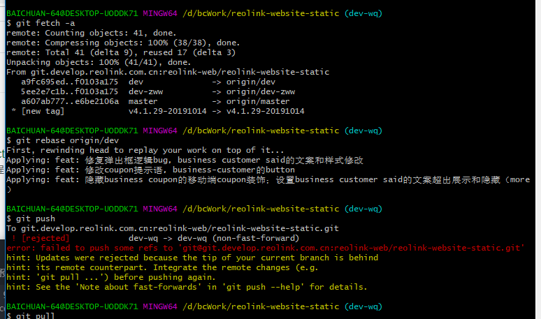

1. git checkout [fileName]
2.	git status
3.	git diff
4.	git add .
5.	git commit -m “”
6.	git commit –-amend -m “”
7.	git fetch -a
8.	git rebase origin/dev
9.	git push
10.	git remote -v
11. git remote remove [XXX]删除仓库
12. git remote rename [old name] [new name]修改原仓库名为新仓库名
13. git 删除分支：git push origin [空格] [冒号] [需要删除的分支名字]

# 记10/16 2019遇到的fetch -a、git rebase origin/dev 没有冲突却有如下提示的问题

由图可知，提示：当前分支已经落后了，是因为没有git pull的关系，所以，要先pull。但是pull后就直接显示冲突
解决：以后遇到这种问题要记住，这是需要强制push：git push -f;而不是rebase失败

如果要是认为是rebase 失败选择了git pull结果发现冲突：
1.git log：看看log出来的第一个是不是刚提交的，（这里是是的）
2.git reset --hard:这是在log出来的是我的的情况下的操作，作用是退出merging,此时再git log第一个还是我的（不是我的代码就没咯）
3.然后强制提交：git push -f
4.完毕
