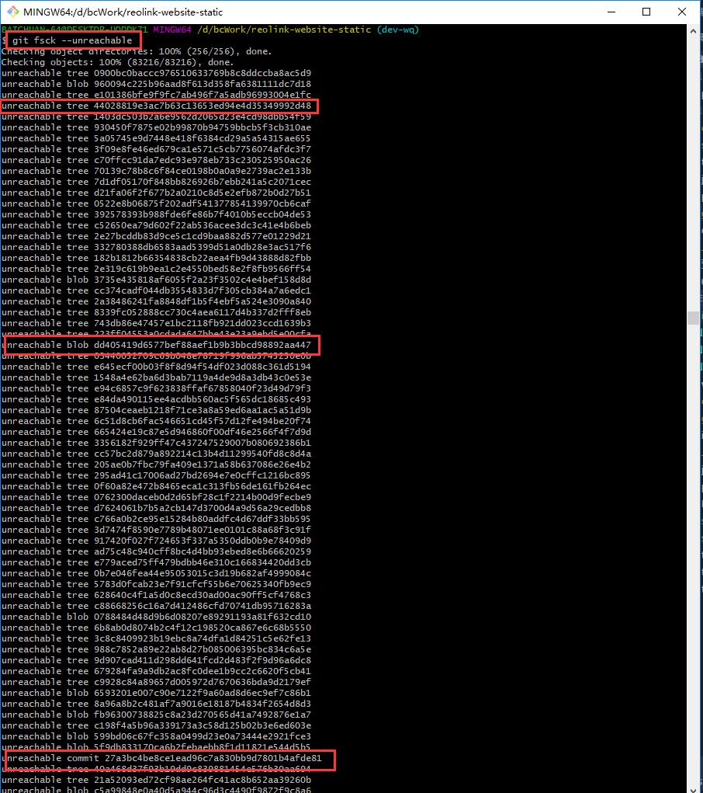
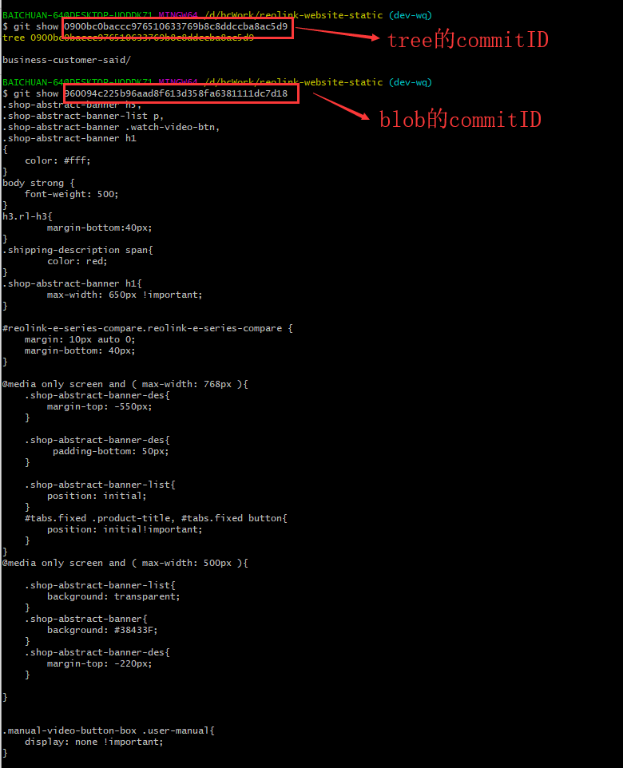

1. git checkout [fileName]
2.	git status
3.	git diff
4.	git add .
5.	git commit -m “”
6.	git commit –-amend -m “”
7.	git fetch -a
8.	git rebase origin/dev
9.	git push
10.	git remote -v
11. git remote remove [XXX]删除仓库
12. git remote rename [old name] [new name]修改原仓库名为新仓库名
13. git 删除分支：git push origin [空格] [冒号] [需要删除的分支名字]

# 记10/16 2019遇到的fetch -a、git rebase origin/dev 没有冲突却有如下提示的问题

由图可知，提示：当前分支已经落后了，是因为没有git pull的关系，所以，要先pull。但是pull后就直接显示冲突
解决：以后遇到这种问题要记住，这是需要强制push：git push -f;而不是rebase失败

如果要是认为是rebase 失败选择了git pull结果发现冲突：
1.git log：看看log出来的第一个是不是刚提交的，（这里是是的）
2.git reset --hard:这是在log出来的是我的的情况下的操作，作用是退出merging,此时再git log第一个还是我的（不是我的代码就没咯）
3.然后强制提交：git push -f
4.完毕

# 交互式暂存

- 暂存文件
- 取消暂存文件
- 暂存文件的一部分
- 添加未被追踪的文件
- 查看暂存内容的区别

## 问题描述
在同一个分支上写了不同模块不同版本的代码，导致的问题是不能全部提交，只能提交一部分
- 误解：我以为提交这种东西在add的时候一定要全部提交，否则就不可以提上去
- 误解操作：我选择使用stash存储起来部分文件，然后将没有存储的文件提交，最后再把存储起来的文件释放出来
- 遇到的问题是，新的这部分代码是没有跟踪过的，因此，想要stash根本就进不去
- git add -i
  - 进入交互终端模式，显示以下内容
    - 
    - 此时你可以根据给到的number，作出对应的操作
    - 我选择了将其显示出来以后选择了4，即添加跟踪的文件，输入了数字以后，[enter]后它会让你再次输入，此时你直接[enter]就会得到你上一次[enter]添加的文件被跟踪
    - 而后我执行`git stash`:这个操作是会将添加在add里的文件stash起来
    - `git stash -u`:这里是会stash未跟踪的文件（猜想）
    - 我执行了该操作以后，全部就存进去了，而且是只有一个stash，于是我[想]把它给释放出来，我以为它还会在原来的地方，结果，我选择执行`git stash drop stash@{0}`,然后就给我提示：`Dropped stash@{0} (commitID)`
    - 我执行git status想看看我原来的代码，就不可以了，就没了，全没了，告诉我：`Your branch is up to date with "origin/dev-branch".nothing to commit,working tree clean`
    - 自然，东西没了执行也是有问题的，执行什么都无济于事了
  - 如何找回被drop的代码
    - emmm,如何找回被drop的代码，这是个问题
    - 执行`git fsck --unreachable`,这里显示的所有[没有被跟踪的,(这里有待考究，因为我不知道是不是我给他弄成的不被跟踪)]tree和blob,commit，这三个是啥，我不知道，但是这个你选择一个commit，不管是tree的还是blob的，如果是tree的显示的是好像是文件树的一部分
      - 
      - 
      - 这可出了大问题了，这个太多了，没有上千也有成百，怎么办
      - 执行操作` git fsck --unreachable | grep commit`,该处理可以删选出刚才fsck出来的那些commitID中属于commit的ID，选择一个commit的ID，执行`git show commitID`,即可显示出对应的文件，你即可看出是不是你写的那些代码，如果是的，执行操作：`git fsck –lost-found`
      - `git fsck --unreachable | grep 79131fc7e9c4e8b1c6573ca2f5eff78f8cf0d403`,这个commitID（值得庆幸），是我stash drop掉的那个commit的ID，此时你要把你里面的之前添加的没有被跟踪的给删掉，如果第一次执行`git stash apply commitId`不成功的话，要先把之前的git status出来的没有被跟踪的给删掉`rm -rf file-name`（这里不一定，最好自己做好记录和处理，做好备份）
      - 然后执行`git stash apply commitId`就肥来啦！！！
    - 将add过后的文件撤销add的操作：`git reset HEAD`:不加文件名，表示全给撤销掉，添加文件名：`git reset HEAD file-name`:表示撤销这个文件的add状态
    - 查看stash的记录：`git stash list`