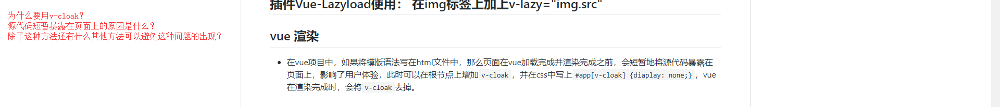

# 安装


- 官网提出，安装vue有三种方式：
  - 直接&#60;script&#62;引入：直接下载并用&#60;script&#62;引入，Vue会被注册成为一个全局变量
  - CDN：直接引入对应地址(&#60;script src="" /&#62; 或者 &#60;script type="module"&#62;import Vue from 'url'&#60;/script&#62;)
  - NPM：在用Vue构建大型应用时推荐使用。NPM能很好的和诸如webpack、Browserify模块打包器配合使用，同时vue也提供配套工具开发单文件组件。
    操作：npm install vue //最新稳定版
  - 命令行工具：vue-cli。
    优点： 1.为单页面应用（SPA）快速搭建繁杂的脚手架，为现代前端工作流提供了batteries-included的构建设置。
          2.速度快，几分钟就可以运行并带有热重载、保存时lint校验，以及生产环境可用构建版本。
    操作：安装vue-cli: npm install -g vue-cli
          生成项目：vue init webpack Vue-Project
          安装依赖：npm install
          启动项目：npm run dev

# Chrome 调试

- Chrome调试能干嘛？

# 插件篇

- fastclick插件与某些插件冲突时，第三方插件阻止了默认的点击事件，自己代理点击事件会被fastclick阻止；如何解决？

  - 1.fastclick插件的作用是什么》解决移动端click事件300毫秒延迟。
  - 2.如何解决如上问题》在需要点击事件的元素上加上class=“needclick”（有的时候无效，是因为该needsClick被拿到后面去执行了）
- Vue-Lazyload
  - 1.what：是一个简单易用的Vue图片延迟加载插件
  - 2.how： npm install vue-lazyload --save
            import VueLazyload from 'vue-lazyload'
            Vue.use(VueLazyload[,{preLoad: 1.3,error: 'dist/error.png'.loading: 'dist/loading.gif',attempt: 1}]) // 中括号可以被省略
            &#60;img v-lazy="img.src"&#62;

# vue 渲染



- v-cloak的作用、如何使用？
  - v-cloak是vue的延缓响应指令，在与css:[v-cloak]{display:none}的配合下，可以隐藏未编译的Mustache标签直到实例准备完毕，v-cloak属性才会被自动去除，对应标签可见。用于解决用Mustache标签插值时所导致的在vue渲染时没有渲染完全而显示Mustache源代码的问题
  - 使用：&#60;div v-cloak&#62; {{msg}}&#60;/div&#62;
          [v-cloak] {
              display:none;
          }
  - 效果：可以隐藏未编译的Mustache标签直到实例准备完毕。
  - 失效的情况：
    - 1.v-cloak的display属性可能被层级更高的css给覆盖了，解决方法：!important 加权： [v-cloak] {display: none !important;}
    - 2.在实际项目中，通常通过@import 来加载css文件：@import "style.css"，而@import是在页面DOM完全载入后才会进行加载，如果v-cloak被写在@import加载的css文件中，就会导致页面仍旧闪烁
    - 解决：将[v-cloak]写在link引入的css中或者写一个内联css样式。
      - 涉及到的问题点：@import、link、内联css的加载先后顺序（对比一下DOM）
- 为什么会出现vue渲染时源代码短暂暴露的问题？
  - 因为Mustache特性的原因。（至于具体为什么，分析原理，我不知道）
  - 网络不好、加载数据过大的情况下，页面在渲染的过程会闪烁Mustache标签
- 除此之外，还有什么方法处理这个问题？
  - [v-bind]:msg 代替 {{msg}}可以避免出现这个问题

## v-bind 双向绑定

- Mustache会将数据解释为普通文本，而非HTML代码
- 当数据改变时，视图会进行重渲染。只有在实例被创建时data中的属性是响应式的，其他的（var vm = new Vue({});vm.b="hi",对b的带动不会触发任何视图的更新）。因此，如果后面会要用到某个属性，最好一开始在data里声明并附个初始值。
- vue 实例暴露一些实例属性和方法（都有前缀&#36;），以便与用户定义的属性区分开。
- 数组初始化是空数组，需要一部获取数组数据时，需要在对应元素上加上v-if判断或者v-for遍历以防止出现数组初始化为空时取值会报错undefined的问题。
  
# CSS隔离

- scoped: scoped属性只能保证本组件的样式不会影响其他组件，不能保证其他组件的样式不影响到本组件。
  - 实质上增加了scoped属性之后，当前组件的所有DOM节点都会增加一个data-v-&#36;{hash}做标识，同样生成的css中将只应用此标识的节点 .selector[data-v-&#36;{hash}],这样就能实现css样式值应用于本组件
  - 通过v-html创建的DOM内容不收scoped样式影响（动态生成的HTML不会加上hash属性），但是你仍然可以通过深度作用选择器来为它们设置样式
  - 使用scoped时性能下降（慢很多倍）
- 当样式只需应用到当前组件的子组件时，如果直接用 .fatherSelector .childSelector,那么生成的css中将是 .fatherSelector .childSelector [data-v-&#36;{fatherHash}],这样将不会应用到子组件的节点，此时应该用深度作用选择器 .fatherSelector >>> .childSelector ,此时生成的css将是 .fatherSelector[data-v-&#36;{fatherHash}] .childerSelector。
  - 使用了sass/less预处理器时，无法正确解析深度选择器，需要使用 /deep/ 或 ::v-deep操作符，它们都是 >>> 的别名。

- 一般在使用到less、sass的项目中，可以用style-resources-loader插件导入全局文件到项目中，例如，需要编译不同主题的时候，可以导入一个主题变量文件，在组件中直接使用这些变量，而不需要每个组件都@import进来。
- 可以在一个组件中同时使用有scoped和非scoped样式。
  - &#60;style&#62;
    /* 全局样式 */
    &#60;/style&#62;
    &#60;style scoped&#62;
    /* 本地样式 */
    &#60;/style&#62;

# class 样式绑定

- 当isActive或者hasError变化时，class列表将相应地更新
  - &#60;div :class="{active:isActive,'text-danger':hasError}"&#62;&#60;/div&#62;
  - &#60;script&#62;
  data() {
  return {
  isActive: true
  }}
  &#60;/script&#62;
- 对象语法
  - &#60;div :class="classObj"&#62;&#60;/div&#62;
  - &#60;script&#62;
   data() {
     return {
       classObj: {
         active: true,
         'text-danger':false
       }
     }
   }
 &#60;/script&#62;
- 对象语法结合计算属性
  - &#60;div :class="classObj2"&#62;&#60;/div&#62;
  - &#60;script&#62;
   computed: {
     classObject2:function() {
       return {
         active: this.isActive && !this.error,
         'text-danger':this.error && this.error.type === 'fatal'
       }
     }
   }
   &#60;/script&#62;
- 数组语法：字符串、变量、对象、三元运算式
  &#60; :class="['static',errorClass,{active:isActive},isActive?activeClass:'']"&#62;&#60;/div&#62;

- 当你在一个自定义组件上用到class属性时，这些类将会被添加到根元素上面，这个元素上已经存在的类不会被覆盖。
  - &#60;template&#62;
      &#60;my-template class="baz boo"&#62;&#60;/my-template&#62;
    &#60;/template&#62;
    &#60;script&#62;
      Vue.component('my-component',{
          template: '&#60;p class="foo bar"&#62;Hi&#60;p&#62;'
      })
    &#60;script&#62;
    &#60;!-- 结果:&#60;p class="foo bar baz boo"&#62;Hi&#60;/p&#62; --&#62;
- 浏览器兼容写法
  - &#60; div :style="{display: ['-webkit-box','-ms-flexbox']}"&#62;&#60;/div&#62;

- 当使用全局定义组件的时候，注意promise的then和catch的回调函数里，this会指向window，需要使用箭头函数解决
- 注意，此时子组件emit一个事件的名字不能用驼峰和连字符写法，有可能无效。

# v-model表单输入双向绑定value值

- 用v-model在表单控件或组件上创建双向绑定，会根据控件类型自动选取正确的方法来更新元素，随表单控件类型不同而不同
- 限制
  - &#60;input&#62;
  - &#60;select&#62;将value作为prop并将change作为事件
  - &#60;textarea&#62; &#60;text&#62; 元素使用value属性、input事件
  - &#60;checkbox&#62; &#60;radio&#62; 元素使用checked属性、change事件
  - components
- 对于需要使用输入法（中、日、韩文）的语言，你会发现v-model不会在输入法组合文字过程中得到更新，若想要处理这个过程，应该使用input事件。
- 修饰符：
  - .lazy - 取代input 监听change事件[,不再即时更新]
  - .number - 输入字符串转为有效的数字(自动将用户的输入值转为Number类型[,如果原值的转换结果为NaN则返回原值])
  - .trim- 输入首尾空格过滤
- v-model绑定的是表单的value值
- v-model会忽略所有表单元素的value、checked、selected特性的初始值，因为它会选择vue实例数据来作为数据来源。应该通过JavaScript在组件的data选项中声明初始值。
- 当被遍历生成的元素为表单元素时，v-model不能直接绑定(item,index) in arr中的item，得使用arr[index](why?)
- 如果v-model绑定的是个计算属性，则双向绑定失效，需要通过设置get、set方法实现(why?)
  
## 表单输入绑定
  
- 单选框：type=radio
- 复选框：type=CheckBox
  - 单选(逻辑值Boolean)
  - 多选(绑定到同一数组)
- select 单选列表
  - 如果第一个选项是不需要匹配任意选项，就加上disabled
- select多选列表
  - 给select标签加上multiple属性
  - data里绑定的属性应该是数组data() {return {selected:[]}}
  - 数据要绑定到一个数组，即使写引号，选中数据依旧会新建中括号再显示数据
- select应用，动态选项
  - v-model作为一个中介，把option的value值和data中的selected值双向绑定，selected值又和{{selected}}绑定，{{}}方法只能和data中的数据双向绑定，而唯一能随option.value变化的只有selected。
  
# v-once 只执行一次插值

- 不需要表达式
  - 只渲染元素和组件一次。随后的重新渲染，元素/组件及其所有的子节点将被视为静态内容并跳过，这可以用于优化更新性能。
- 当数据改变时，插值处的内容不会更新。但请留心这会影响到该节点上所有的数据绑定。
-通过v-once创建低开销的静态组件
  - 渲染普通的html元素在vue中非常快速；在渲染静态内容时，可以在根元素上添加v-onve以确保内容只计算一次，然后缓存起来。
  - 缺点：不要过度使用：一个开发者并不熟悉v-once或漏看了它在模板中，会花很多时间去寻找不更新的原因。

# v-html输出原始html

- 作用：更新元素的innerHTML
- 注意：内容按普通HTML插入-“不会作为vue模板进行编译=>[单文件组件中,scoped的样式不会应用在v-html内部]”。
- 缺点：
  - 1.如果v-html引用的内容不可信的话（千万不要让用户可以输入这段将会被用成innerHTML的内容），会导致xss攻击。
  - 2.单文件组件中，scoped的样式不会应用在v-html内部，因为那部分HTML没有被vue的模板编译器处理。[解决：希望针对v-html的内容设置带作用域的css，可以替换cssModule或用一个额外的全局style元素手动设置类似BEM的作用域策略]
- 如果试图使用v-html组合模板，可以考虑是否使用组件替换。

# v-on 绑定事件、事件监听

- 缩写：@
- 参数： event
- 修饰符：(使用修饰符时顺序是会对使用修饰符结果有所影响的)
  - 事件修饰符：
    - .stop - 调用event.stopPropagation() -> 阻止单击事件继续传播
    - .prevent -调用event.preventDefault() -> 提交事件不再重载页面
    - .capture -添加事件侦听器时使用capture模式
    - .self -只当事件是从侦听器绑定的元素本身触发时才触发回调
    - .{keyCode | keyAlias} -只当事件是从特定键触发时才触发回调
    - .native -监听组件根元素的原生事件
    - .once -只触发一次回调
    - .passive -以{passive:true}模式添加侦听器
  - 鼠标按钮修饰符(会限制处理程序监听特定的滑鼠按键)
    - .left/.right/.middle -只当点击鼠标左键/右键/中键时才触发
  - 键值修饰符：&#60; input @keyup.13="submit"&#62;只有在keyCode是13时调用vm.submit();可以通过全局config.keyCodes对象自定义键值修饰符别名：Vue.config.keyCodes.f1 = 112 ==> 可以使用v-on:keyup.f1
    - @keyup.enter
    - @keyup.tab
    - @keyup.delete(捕获删除、退格键)
    - @keyup.esc
    - @keyup.up
    - @keyup.down
    - @keyup.left
    - @keyup.right
  - 修饰键(与keyup事件一起用时，事件引发时必须按下正常的按键，即如果要引发keyup.ctrl,必须按下Ctrl时释放其他的按键，单单释放Ctrl不会引发事件)
    - .ctrl
    - .alt
    - .shift
    - .meta
    - &#60;input @keyup.alt.67="clear"&#62;
    - &#60; div @click.ctrl = "doSomething" &#62; Do SomeThing &#60; /div &#62;
- 用法：
  - 绑定事件监听器，事件类型由参数指定。表达式可以是一个方法的名字或一个内联语句，可省略修饰符
    - 方法处理器v-on:click="doThis"
    - 内联语句 v-on:click="doThat('hello',&#36;event)" -> 就是在方法里加参数
  - 动态事件v-on:[event] = "doThis"
  - 停止冒泡 @click.stop = "doThis"
  - 阻止默认行为
    - @click.prevent = "doThis"
    - 没有表达式：@submit.prevent
  - 对象语法： v-on="{mousedown:doThis,mouseup:doThat}"
  - 普通元素时，只能监听原生DOM事件[ 此时方法以事件为唯一的参数，如果使用内联语句，语句可以访问一个&#36;event属性，v-on:click="handle('ok',&#36;event)" ]；自定义元素组件上时，也可以监听子组件触发的自定义事件。
  - 支持不带参数绑定一个事件/监听器键值对的对象，使用对象语法时，是不支持任何修饰器的
- 绑定事件可以不设置对应的响应方法
  
# v-if 条件判断

- v-else、v-else-if 必须紧跟在 v-if 或 v-else-if 元素之后。
- key属性：禁止相同元素被高效的复用，区分相同的元素，声明“这两个元素是完全独立的————不要复用它们”
- &#60;!-- 切换 loginType 将不会清除用户已经输入的内容。因为两个模板使用了相同的元素，&#60;input&#62; 不会被替换掉——仅仅是替换了它的 placeholder --&#62;
    &#60;template v-if="loginType === 'username'"&#62;
        &#60;label&#62;Username&#60;/label&#62;
        &#60;input placeholder="Enter your username"&#62;
    &#60;/template&#62;
    &#60;template v-else&#62;
        &#60;label&#62;Email&#60;/label&#62;
        &#60;input placeholder="Enter your email address"&#62;
    &#60;/template&#62;

    &#60;!-- 只需添加一个具有唯一值的 key 属性即可：每次切换时，输入框都将被重新渲染，元素label仍然会被高效地复用，因为它们没有添加 key 属性。 --&#62;
    &#60;template v-if="loginType === 'username'"&#62;
        &#60;label&#62;Username&#60;/label&#62;
        &#60;input placeholder="Enter your username" key="username-input"&#62;
    &#60;/template&#62;
    &#60;template v-else&#62;
        &#60;label&#62;Email&#60;/label&#62;
        &#60;input placeholder="Enter your email address" key="email-input"&#62;
    &#60;/template&#62;

# v-show显示隐藏元素

- 带有v-show的元素始终会被渲染并保留在DOM中，v-show是简单的切换元素的css属性的display
- v-show不支持&#60;template&#62;语法，也不支持v-else
- v-show="false"时，display:none

## v-show,v-if区别

- -----------------------------------------------------------------------------
- v-if 

  - 是真正的条件渲染，会确保在切换过冲中条件块内的事件监听器和子组件适当的被销毁和重建
  - 是惰性的，在初始渲染时条件为假，则什么也不做，直到第一次变为真时，才开始渲染条件块
  - 有更高的切换开销（适用于运行时不太可能改变的情况
- ------------------------------------------------------------------------------
- v-show
  - 初始时无论条件如何，都会被渲染，并且只进行简单的基于css进行切换
  - 有更高的初始渲染开销（适用于需要非常频繁的切换）

# v-for循环 v-for(item in/of items)

当vue.js用v-for正在更新已渲染过的元素列表时，它默认用“就地复用”策略。列表数据修改的时候，它会根据key值去判断某个值是否修改，如果修改，则重新渲染这一项，否则复用之前的元素。
:key="index"

常见的数据更新情况：
1.在最后一条数据后再加一条数据（使用index还是使用唯一标识ID都可以）
2.在中间插入一条数据（使用index，会发现从要插入的地方开始，都需要重新渲染，那么，使用唯一标识ID可以相较于index来说，提高复用率和效率）

react使用map渲染列表，也是必须加key,且推荐做法是使用ID
虚拟DOM也是类似的，因为虚拟DOM使用diff算法实现的原因

总的来说，key的作用主要是为了高效的更新虚拟DOM，另外使用vue中在使用相同标签名元素的过渡切换时，也会使用到key属性，其目的也是为了让vue可以区分它们，否则vue只会替换其内部属性而不会触发过渡效果
>>> 为什么要触发这个过渡效果
网页中存在切换场景，vue提供了一个简单的切换过渡效果。用&#60;transition&#62;标签包裹要切换的部分即可。
多元素过渡使用 :key
多组件过渡： 动态组件

过渡模式：in-out：新元素先进行过渡，完成之后当前元素过渡离开；out-in：当前元素先进行过渡，完成之后新元素过渡进入

## v-for VS v-if

当处于同一节点，v-for优先级 > v-if(意味着v-if将分别重复运行于每个v-for循环中，当你想为仅有的一些项渲染节点时，这种优先级的机制会十分有用)
如果想在v-for循环以前执行某个条件，则需要将v-if放到v-for的父元素上

# computed计算属性
- 计算属性是基于它们的依赖message进行缓存，依赖不改变则访问时会返回原来的计算结果，而不是再次执行函数。
- 计算属性默认只有getter，在需要时可以提供一个setter
# watch 监听data某个属性的变化
- 当你想要在数据变化响应时执行异步操作或开销较大的操作时，可选择使用watch。watch允许在执行异步操作（访问一个API）时限制我们执行该操作的评率，并在我们得到最终结果前，设置中间状态（计算属性无法做到）
  - 数组（一维、多维）的变化不需要通过深度监听，对象数组中对象的属性变化则需要deep深度监听

# $nextTick()

## Event Loop：事件循环机制

- JS执行是单线程的，


- JS执行是单线程的，是基于时间循环的
- 所有同步任务都在主线程上执行，形成一个执行栈
- 主线程之外，还存在一个任务队列，只要异步任务有了运行结果，就在任务队列之中放一个事件
- 一旦“执行栈”中的所有同步任务执行完毕，系统就会读取“任务队列”，看看里面有哪些事件。哪些对应的异步任务，于是结束等待状态，进入执行栈，开始执行，主线程会不断重复此步骤
- 在vue中，数据的变化后，DOM的更新会被推入到任务队列中，如需依赖更新后的DOM，则需要用$nextTick()
  - methods内：
    - this.$nextTick(function(){
    - console.log()
    - })
  
# 自定义指令
- 作用： 解决需要对普通DOM元素进行底层操作的问题
- 如何使用：
  - `<input v-focus />`(v-focus是自定义的指令，可以直接当做普通指令使用，有两种注册方式)
  - 全局注册：
    ```
    Vue.directive('focus',{    // focus就是指令名，不需要前面的v-,vue会自动添加
      inserted: function(el) {
        el.focus()
      }
    })
    ```
  - 局部注册：
  ```
  direvtives: {
    focus: {
      inserted: function (el) {
        el.focus()
      }
    }
  }
  ```

- 自定义指令对象提供的钩子函数（均为可选）
  - bind：只调用一次，指令第一次绑定到元素时调用，在这里可以进行一次性的初始化设置。
  - inserted：被绑定元素插入父节点时调用，仅保证父节点存在，但不一定已被插入文档之中。
  - update：所在组件的虚拟节点更新时调用，可能调用时该节点的子节点还没有更新。指令的值可能发生改变，也可能没有，但是你可以通过比较前后的值来忽略不必要的模板更新。
  - componentUpdated：指令所在组件的VNode及其子节点全部更新后调用
  - unbind：只调用一次，指令与元素解绑时调用。
- 流程
  - 感觉自定义指令提供的钩子也可以理解为一个生命周期的过程，不同阶段有不同的钩子函数
  - 流程图如图vue.seqdiag=>title:directive

- 钩子函数提供的参数：
  - el: 指令所绑定的元素，可用来直接操作DOM
  - binding: 一个对象，包含属性如下
    - name:指令名，不包括v-前缀
    - value：指令的绑定值
    - oldvalue：指令绑定的前一个值，仅在update和componentUpdated钩子中可用，无论值是否改变
    - expression：字符串形式的指令表达式
    - arg:传给指令的参数，可选
    - modifiers：一个包含修饰符的对象
  - vnode：vue编译生成的虚拟节点
  - oldVnode：上一个虚拟节点，仅在update、componentUpdated钩子中可用
  - `钩子之间共享数据，通过dataset来进行`
  - 在需要对指令进行复用时，可用动态指令参数对其进行处理
    - 动态指令参数：在data初始时声明一个变量，在使用自定义指令时，将该变量传给自定义指令以达到使得自定义指令被复用的目的。
