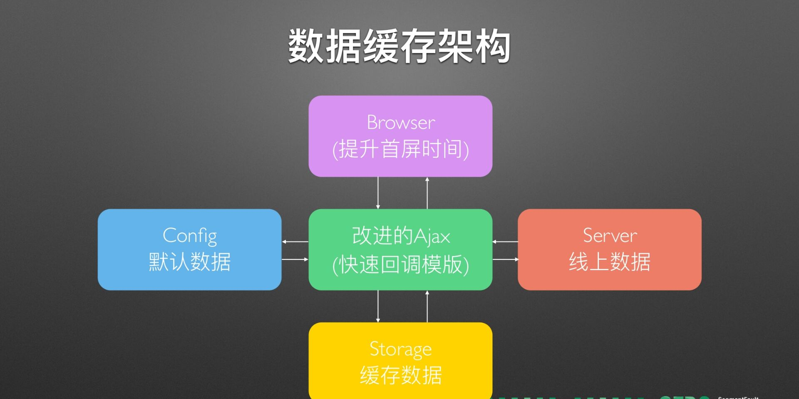
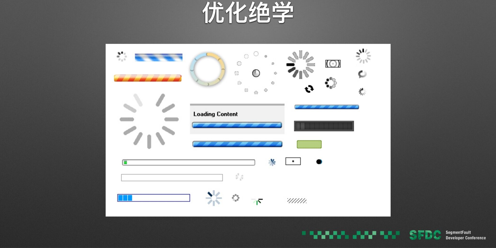

# 为什么讲性能

- 不像框架成体系
- 代码级到工程级，跨度大
- 特定场景
- 积累 or 飞跃

# 分享内容

- 前端性能的知识
- 性能分析工具
- 优化思路与学习方法
- 性能优化实践

# 前端性能的知识

- 大家眼里的性能：
  - js执行效率
  - 浏览器渲染性能
  - css动画性能
  - 事件代理
  - 雅虎优化建议

## 页面加载性能

- 优化后：渐进式渲染
- 未优化：直接渲染

# 影响首屏时间因素

- UI展现----Last HTTP Response Data----->  业务逻辑
- 资源加载 <-----HTTP Rsponse Data------云端服务
- HTTP <------http response 200 ok -------HTTP
- HTTP ------ HTTP GET(url) -------> HTTP
- TCP/UDP<-------TCP连接建立--------> TCP/UDP
- IP<-------DNS查询及响应/选择APN，IP分配，启动计费-----------> IP
- 无线网络协议<-----网络附着，加密，鉴权,无XX线路分配（不知道）---------->有线网络协议
- DOM、CSSOM，renderTree

# 小结

- 前端性能分两部分
  - 网络性能
  - 运行时性能
- 重点关注影响用户体验部分

# 性能分析工具

- PageSpeed
- DevTools Timeline
- 网络耗时测定

# 优化思路与学习方法

- 优化思路
  - 减少网络时间
  - 高效利用缓存
  - 网络延迟（RTT）
  - 不同网络RTT
- 链路复用
  - TCP3次握手
  - keep-alive提升的部分
  - Server内存消耗，预先扩容
  - 实际提升效果

# HTTP/2 来了

- 二进制分帧层
- 首部压缩
- 多路复用
- 服务端推送

## TSL握手、TCP慢启动

- 初始化窗口数（10）
- 单个RTT内传输数据上限14kb
- http/2依旧受限
- 小结
  - 性能优势集中体现在多路复用和服务端推送上
  - 请求数越多，RTT越大，优势越明显
  - 依旧受HTTPS、TCP协议限制
- 学习方法
  - 深入底层，知晓原理
  - 辩证思维，不被新概念洗脑
  - 加以实践，论证有效

# 性能优化实践

- 服务端渲染
  - Ajax模式下，数据与页面资源串行
  - 缩短网络路径，降低网络异常影响
  - 使用Node.js进行服务端渲染
  - 组件前后端同构
- 图片懒加载
  - 模板渲染时，不赋值src
  - 插入DOM树时进行可视区域计算
  - 如果图片在可视区内，赋值src
  - 如果图片在可视区外，留着scroll处理
- 更智能的打包
  - modules with dependencies --webpack(module bundler)--> static assets
- 高效利用缓存
  - 网络缓存
    - HTML 304 Cache
    - 静态资源Long Cache(max-age)
    - 文件MD5命名
    - 背后的考虑：RTT影响，CDN刷新问题
  - 数据缓存设计
    - 高可配置化（本次是否使用、缓存时间等）
    - 更新通知机制
    - 默认数据配置
    - 重要数据标记
    - 过期清除算法
  - 数据缓存架构
  - 

# 实在无法优化了

